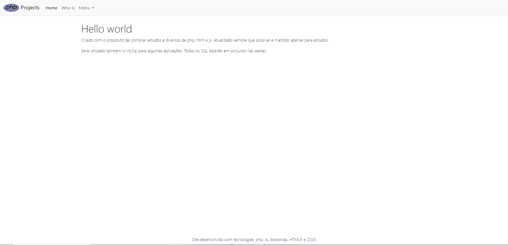
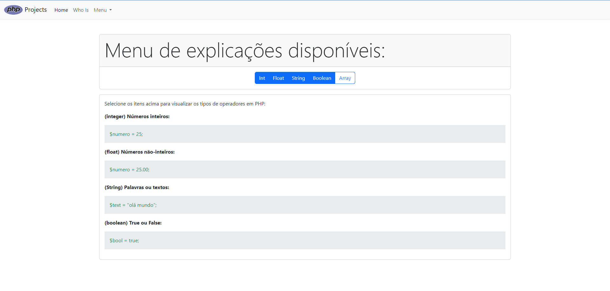
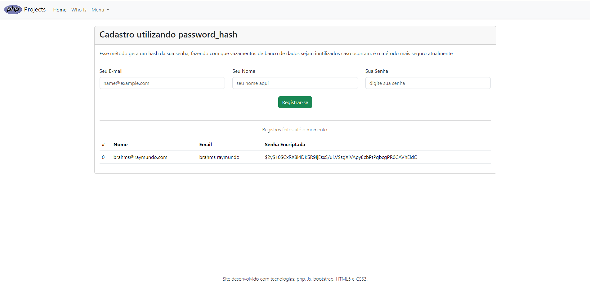

# Projetos em PhP
Projetos em PhP para estudo, funções, php com mysql, utilização de Js e afins

## Homepage do site que desempenha funções em php
O site foi feito com auxilio do bootstrap 5, introduzido via composer. Além disso conta com linguagens: HTML5, CSS3, javascript e claro **PHP.**

### Profile
Foi criada uma página básica de apresentação do usuário que produziu esse código:

## Página de operadores PHP
É uma página que demonstra operadores PHP, onde ao selecionar objetos do menu, o usuário pode visualizar ou esconder os tópicos:

## Página de exemplo de encriptação de senhas
A página conta com um sistema de cadastro e uma tabela que é alimentada de acordo com os dados enviados ao banco de dados demonstrando a capacidade da função password_hash de encriptar senhas, além de conter a sql utilizada para produzir o banco de dados:

